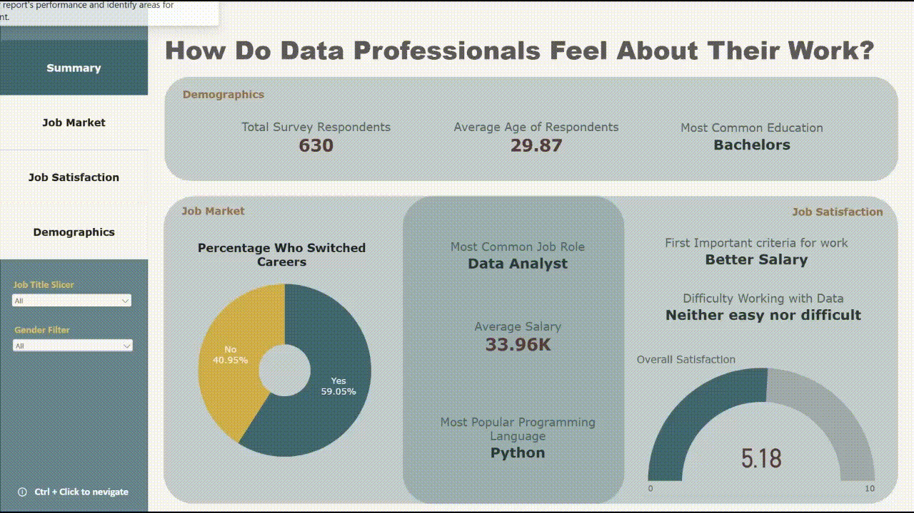

# Power BI Data Professional Survey Dashboard

## About the Project

This project uses survey data from data professionals to explore **demographics, the job market, and job satisfaction** within the data industry.
The dashboard uses a range of interactive visualisations to identify patterns in respondents' backgrounds, career choices, programming language preferences, salaries, and workplace satisfaction.

## Demonstration




## Power BI Skills Applied
* Custom tooltips
* Further analysis and drill-down insights
* Slicers
* Page navigation
* Zoom sliders
* Data label formatting and editing
* Interactive dashboard design

## Visualisations
The project demonstrates the use of:

* Cards
* Donut charts
* Pie charts
* Treemaps
* Gauge charts
* Area charts
* Stacked bar charts
* 100% stacked bar charts
* Stacked column charts
* 100% stacked column charts
* Clustered column charts

## DAX
Several DAX calculations were created to support the dashboard, including average age, career switching rate, custom sorting, most common responses, and percentage calculations.

### Average Age
```DAX
Avg age =
AVERAGE('Data Professional Survey'[Age])
```

### Career Switch Percentage
```DAX
Career Switch % =
DIVIDE(
    CALCULATE(
        COUNTROWS('Data Professional Survey'),
        'Data Professional Survey'[Career Switch] = "Yes"
    ),
    CALCULATE(
        COUNTROWS('Data Professional Survey'),
        NOT ISBLANK('Data Professional Survey'[Career Switch])
    )
)
```

### Education Sort
```DAX
Education sort =
SWITCH(
    'Data Professional Survey'[Highest Level Education],
    "High School", "1",
    "Associates", "2",
    "Bachelors", "3",
    "Masters", "4",
    "PHD", "5",
    "Unknown", "6"
)
```

### Most Common Difficulty
```DAX
Most Common Difficulty =
VAR DifficultyCounts =
    ADDCOLUMNS(
        VALUES('Data Professional Survey'[Difficult to break into data]),
        "ResponseCount",
            CALCULATE(COUNTROWS('Data Professional Survey'))
    )
VAR TopResponse =
    TOPN(
        1,
        DifficultyCounts,
        [ResponseCount],
        DESC
    )
RETURN
    CONCATENATEX(
        TopResponse,
        'Data Professional Survey'[Difficult to break into data],
        ", "
    )
```

### Percentage by Criteria
```DAX
Percentage (Criteria) =
COUNT('Data Professional Survey'[Important criteria for work]) /
CALCULATE(
    COUNT('Data Professional Survey'[Important criteria for work]),
    REMOVEFILTERS('Data Professional Survey'[Job Title])
)
```
